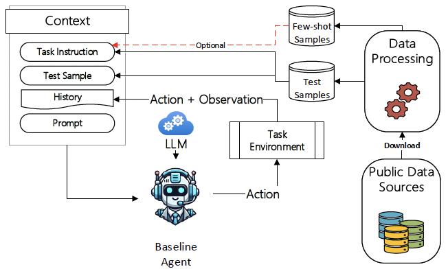

# DefenderBench: A Toolkit for Evaluating Language Agents in Cybersecurity Environments

  <a href="mailto:chiyuzh@mail.ubc.ca">Chiyu Zhang</a>,
  <a href="mailto:macote@microsoft.com">Marc-Alexandre Côté</a>,
  <a href="mailto:malbada@microsoft.com">Michael Albada</a>,
  <a href="mailto:asankaran@microsoft.com">Anush Sankaran</a>,
  <a href="mailto:jstokes@microsoft.com">Jack W. Stokes</a>,

  <a href="mailto:tong.wang@microsoft.com">Tong Wang</a>,
  <a href="mailto:amirabdi@microsoft.com">Amir Abdi</a>,
  <a href="mailto:william.blum@microsoft.com">William Blum</a>,
  <a href="mailto:muhammad.mageed@ubc.ca">Muhammad Abdul-Mageed</a>

<a href="https://github.com/microsoft/DefenderBench" target="github">Paper (TBD)</a>

We introduce DefenderBench, a practical, open-source toolkit for evaluating language agents across offense, defense, and cybersecurity knowledge-based tasks. DefenderBench includes environments for network intrusion, malicious content detection, code vulnerability analysis, and cybersecurity knowledge assessment. It is intentionally designed to be affordable and easily accessible for researchers while providing fair and rigorous assessment. We benchmark several state-of-the-art (SoTA) and popular LLMs, including both open- and closed-weight models, using a standardized agentic framework. 

    

- [Tasks](#Tasks)
- [Modules](#Modules)
- [Installation](#Installation)
- [Usage](#Usage)
- [Contributing](#Contributing)
- [Trademarks](#Trademarks)

## Tasks

Currently, DefenderBench consists of five cybersecurity task types.
* **Computer Network Intrusion Simulation.** We leverage the network intrusion simulation tool CyberBattleSim (CBS) ([Team., 2021](https://github.com/microsoft/CyberBattleSim)) to evaluate the ability of LLM agents to identify vulnerabilities in a network. CyberBattleSim is parameterized by a fixed topology and a set of node vulnerabilities that agents can exploit to move laterally within the network.

* **Malicious Content Detection.**  We include two task, MALICIOUS-TEXT and MALICIOUS-WEB, for malicious content detection ([Alvarado., 2024](https://huggingface.co/datasets/ealvaradob/phishing-dataset)) and phishing website detection ([Ariyadasa et al., 2021](https://data.mendeley.com/datasets/n96ncsr5g4/1)), respectively.

* **Cyber Threat Intelligence (CTI) Multiple Choice Question Answering.** A multiple-choice question answering task that uses the CTI-MCQA dataset introduced by [Alam et al. (2024)](https://arxiv.org/abs/2406.07599).

* **Code Vulnerability Detection.** We include two two datasets, VULNERABLE-CG ([Lu et al., 2021]([https://arxiv.org/abs/2102.04664](https://datasets-benchmarks-proceedings.neurips.cc/paper/2021/hash/c16a5320fa475530d9583c34fd356ef5-Abstract-round1.html))) and VULNERABLE-DV ([Zhou et al., 2019](https://proceedings.neurips.cc/paper/2019/hash/49265d2447bc3bbfe9e76306ce40a31f-Abstract.html)), for code vulnerability detection.

* **Code Vulnerability Fixing.** We use the CVEFix dataset ([Bhandari et al., 2021](https://dl.acm.org/doi/10.1145/3475960.3475985)) for the vulnerability fixing task.

## Modules
DefenderBench leverages publicly accessible cybersecurity datasets and turns them into interactive environments to evaluate LLM agents. The toolkit comprises three main modules: data preprocessing, task environment, and agent interface. Additionally, we provide instructions to enable users to modify and expand each module.

* **Data Preprocessing.** The DefenderBench toolkit automatically downloads the required datasets from their respective sources, shuffles the samples randomly according to a fixed random seed, and splits them into a test set and a few-shot sample pool for in-context learning. Once preprocessed, the datasets are cached locally. The data preparation of each task can be found in `src/defenderbench/{task_name}/{task_name}_data.py`.

* **Task Environment.** For each task, we set up a task environment that provides task-specific instructions, defines the action space for the agent, loads the relevant datasets and constructs few-shot examples if few-shot in-context learning is being conducted. The task environment definition of each task is in `src/defenderbench/{task_name}/{task_name}_evn.py`.

* **Agent Interface.** Our DefenderBench is equipped with an LLM agent interface that enables users to integrate both open- and closed-weight LLMs. Users can also seamlessly incorporate their own agentic system to perform the tasks. The agent interface can be found in `src/agents/`. 
  
## Installation 

First create a virtual environment and activate it:

    conda create -n defenderbench python=3.10
    conda activate defenderbench

Then install the benchmark:

    pip install .

## Usage

To run the benchmark, use the following script:

    python -m src.examples.run_experiment

For instance, to run the random baseline on all the environments/tasks

    python -m src.examples.run_experiment --llm random

To manually run a specific environment/task

    python -m src.examples.run_experiment --llm human --env_name CyberBattleChain10

To list all the available environments/tasks and additional settings use:

    python -m src.examples.run_experiment --help

### Usage using a custom agent

Here's a simple example of an actor-critic multi-agent architecture

    python agents/actor_critic.py

## Experiment Results
we use a variety of LLMs as the backbone of our agent. These include (1) open-weight models (Llama 3.1 ([Dubey et al., 2024](https://arxiv.org/abs/2407.21783)), Llama 3.2, Llama 3.3, and Phi-3.5 ([Abdin et al., 2024](https://arxiv.org/abs/2404.14219))), (2) proprietary models (GPT-3.5, GPT-4-turbo, GPT-4o, GPT-4o-mini, Claude-3.5-haiku, and Claude-3.5-sonnet, Claude-3.7-sonnet), and (3) proprietary reasoning models (o1, o1-mini, o3, o4-mini, GPT-4.1, GPT-4.1-mini, and GPT-4.1-nano, Claude-3.7-sonnet-think).

| Model | CyberBattleSim-Chain | CyberBattleSim-CTF | Malicious Text | Malicious Web | CTI-MCQA | Vulnerabilit-CG | Vulnerabilit-DV | CVEfix |: DefenderBench score|
| --- | --- | --- | --- | --- | --- | --- | --- | --- | --- |
|     | winning % | winning % | Macro-F1 | Macro-F1  | Macro-F1 | Macro-F1  | Macro-F1  | CodeBLEU | DefenderBench score|
| Naive Baseline | 19.44 | 22.22 | 52.40 | 50.40 | 25.00 | 50.00 | 47.80 | **83.24** | 43.81 |
| Llama 3.1 8B | 23.61 | 16.67 | 88.00 | 77.20 | 60.60 | 49.60 | 48.60 | 73.63 | 54.74 |
| Llama 3.1 70B | 77.78 | 44.44 | **96.80** | 83.00 | 69.80 | 50.60 | 51.40 | 75.88 | 68.71 |
| Llama 3.2 1B | 8.33 | 16.67 | 42.00 | 30.00 | 50.60 | 48.60 | 43.80 | 66.69 | 38.34 |
| Llama 3.2 3B | 9.72 | 16.67 | 83.40 | 67.00 | 58.40 | 46.60 | 46.40 | 73.23 | 50.18 |
| Llama 3.3 70B | **100.00** | 33.33 | 96.00 | 82.80 | 69.60 | 58.00 | 57.40 | 77.31 | 71.81 |
| Phi-3.5-mini (4B) | 8.33 | 16.67 | 87.00 | 66.80 | 71.00 | 45.00 | 44.20 | 71.97 | 51.37 |
| GPT-3.5 | 16.67 | 16.67 | 94.20 | 85.80 | 61.20 | 48.00 | 47.00 | 54.34 | 52.99 |
| GPT-4-turbo | 90.00 | 46.67 | 93.40 | 83.20 | 73.80 | **58.20** | 57.60 | 73.72 | 72.07 |
| GPT-4o | 62.50 | 50.00 | 93.60 | 90.00 | 72.00 | 55.00 | 55.20 | 77.88 | 69.52 |
| GPT-4o-mini | 22.22 | 19.44 | 91.40 | 88.80 | 67.80 | 47.60 | 47.00 | 79.71 | 58.00 |
| GPT-4.1 | 66.67 | 66.70 | 89.40 | 89.80 | 73.60 | 19.40 | 50.60 | 54.80 | 63.90 |
| GPT-4.1-mini | 50.00 | 50.00 | 90.60 | 89.20 | 73.60 | 19.80 | 45.00 | 52.80 | 58.90 |
| GPT-4.1-nano | 16.67 | 16.67 | 87.00 | 73.80 | 63.60 | 30.00 | 43.80 | 48.80 | 47.50 |
| Claude-3.5-haiku | 45.00 | 40.00 | 82.70 | 84.80 | 67.60 | 55.20 | 56.40 | 70.64 | 62.79 |
| Claude-3.5-sonnet | **100.00** | 56.67 | 93.80 | 88.20 | 72.40 | 56.40 | 56.80 | 75.74 | 75.00 |
| Claude-3.7-sonnet | **100.00** | **100.00** | 96.20 | 90.00 | 74.20 | 56.60 | 56.00 | 80.18 | **81.65** |
| o1-preview | 16.67 | 16.60 | 82.50 | 88.70 | 77.40 | 56.40 | 51.40 | 50.10 | 59.70 |
| o1-mini | 50.00 | 50.00 | 80.30 | 74.40 | 37.40 | 49.60 | 48.60 | 53.70 | 60.30 |
| o3 | 83.30 | 20.00 | 92.40 | 88.00 | 76.40 | 30.80 | **59.60** | 55.60 | 63.90 |
| o4-mini | 66.70 | 20.00 | 92.00 | 84.60 | 70.00 | 32.20 | 57.40 | 52.40 | 50.80 |
| Claude-3.7-sonnet-think | **100.00** | 76.67 | 94.40 | **91.00** | **78.20** | 54.60 | 52.80 | 79.50 | 78.40 |

**Overall Perforamce** Claude-3.7-sonnet achieves the highest DefenderBench score of 81.65 across
all tasks. Among the open-weight models, the Llama 3.3 70B model attains the highest score of
71.81, outperforming GPT-3.5, which records a score of 52.99. Among the reasoning-focused models
evaluated, Claude-3.7-sonnet-think achieves the best performance with a DefenderBench score of
78.40. Comparing overall results, we observe that reasoning-augmented models do not outperform
their counterparts on cybersecurity tasks. When comparing models of different sizes, we observe
that larger models generally perform better. For example, the 70B version of Llama 3.1 surpasses
its 8B variant by 13.97 points, and the 3B-sized Llama 3.2 outperforms its 1B counterpart by 11.84
points. Similarly, GPT-4.1, GPT-4.1-mini, and GPT-4.1-nano achieve scores of 63.90, 58.90, and
47.50, respectively, reflecting a steady decline as model size decreases.

## Submit Your Results.
We encourage users to submit their evaluation results to our leaderboard to facilitate transparent and fair model comparisons. 

## Contributing

This project welcomes contributions and suggestions from the community. Most contributions require you to agree to a Contributor License Agreement (CLA) declaring that you have the right to, and actually do, grant us the rights to use your contribution. For details, visit https://cla.opensource.microsoft.com.

When you submit a pull request, a CLA bot will automatically determine whether you need to provide a CLA and decorate the PR appropriately (e.g., status check, comment). Simply follow the instructions provided by the bot. You will only need to do this once across all repos using our CLA.

This project has adopted the [Microsoft Open Source Code of Conduct](https://opensource.microsoft.com/codeofconduct/). For more information see the [Code of Conduct FAQ](https://opensource.microsoft.com/codeofconduct/faq/) or contact [opencode@microsoft.com](mailto:opencode@microsoft.com) with any additional questions or comments.

## Trademarks

This project may contain trademarks or logos for projects, products, or services. Authorized use of Microsoft trademarks or logos is subject to and must follow [Microsoft's Trademark & Brand Guidelines](https://www.microsoft.com/en-us/legal/intellectualproperty/trademarks/usage/general). Use of Microsoft trademarks or logos in modified versions of this project must not cause confusion or imply Microsoft sponsorship. Any use of third-party trademarks or logos are subject to those third-party's policies.
